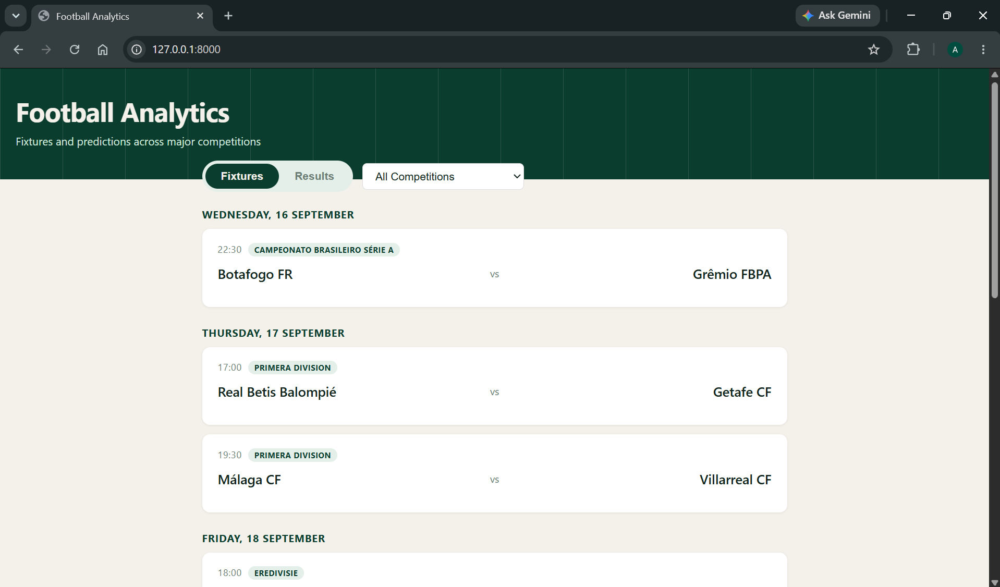
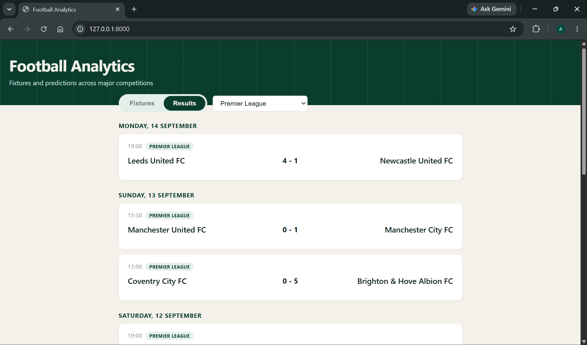
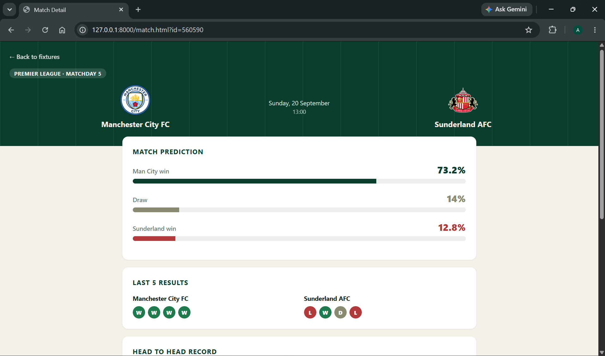
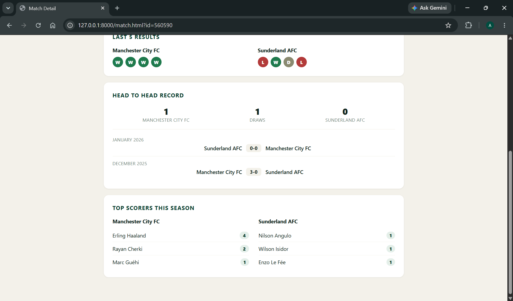

# Football Analytics

A full-stack app that predicts football match outcomes using machine learning.

It pulls live and historical match data, engineers features like team form and Elo ratings, and feeds them into a trained model, all built end-to-end: data pipeline, ML model, API, and frontend.

  

## Screenshots

**Fixtures view**


**Results view**


**Match prediction page**




## Features

* Retrieve fixtures and results via the football-data.org API
* Analyse recent team form and head-to-head history
* Calculate and maintain team Elo ratings, with season-boundary regression
* Generate engineered match statistics (goals scored/conceded, home/away differentials)
* Predict match outcome (home win / draw / away win) with a probability for each
* Match detail pages with prediction probability bars, form chips, h2h history, and top scorers
* League filtering, fixture/results toggling, and date-grouped match cards

## Machine Learning

A custom **Elo rating system** forms the core feature, built from scratch, with season-boundary regression so ratings don't carry an unfair edge across seasons. On top of that sits engineered form and goals-based features (recent form, home/away goal differentials).

Two models were tested. **Logistic regression** topped out at **50% accuracy**, and consistently underperformed because it rarely predicted draws, leaning too hard toward picking a winner. A **Random Forest classifier** handled that better, reaching **53.6% accuracy** against a 44.6% baseline (always predicting home win).

Getting there involved fixing three real bugs: a StandardScaler leak between training and inference, an Elo tuple-unpacking error leaking post-match ratings into pre-match features, and a backwards label mapping in the prediction pipeline.

Predictions are scoped to the **Premier League** for now, where the historical data is deepest. Form and head-to-head data still work for every competition, it's only the ML prediction that's Premier League-only.

**Why no odds/shot data?** The free football-data.org API tier doesn't include odds or shot data for upcoming fixtures, so the live model sticks to Elo/form/goals features. An odds-inclusive version was tested separately, see Extensions.

Cross-validation shows the current ceiling is the feature set, not the model choice, that's what's driving the Extensions below.

## Tech Stack

* Backend: Python, FastAPI
* Data processing: Pandas, NumPy
* Machine learning: Scikit-learn, Joblib (model persistence)
* Frontend: JavaScript, HTML, CSS
* Data source: football-data.org API

The backend handles all filtering, sorting, and pagination, the frontend stays a thin presentation layer over the API.

## Project Structure

```
football-analytics/
├── backend/       # FastAPI app and API request handling
├── frontend/      # Web interface (fixtures, results, match detail pages)
├── prediction/    # ML pipeline, feature engineering, and models/
└── requirements.txt
```

---

## Running the Project

**1. Clone the repo**

```
git clone https://github.com/AlexJ157/football-analytics.git
cd football-analytics
```

**2. Install dependencies**

```
pip install -r requirements.txt
```

**3. Configure your API key**

Get a free API key from [football-data.org](https://www.football-data.org/), then create a `.env` file in the project root:

```
FOOTBALL_DATA_API_KEY=your_key_here
```

**4. Start the server**

```
uvicorn backend.main:app --reload
```

**5. Open the app**

Go to `http://127.0.0.1:8000` in your browser.

Don't open `frontend/index.html` directly, the frontend is served by FastAPI, and opening the file straight from disk breaks the API requests (browsers block `file://` pages from making fetch calls).

API docs are available at `http://127.0.0.1:8000/api/status` for a health check, and full interactive docs at `http://127.0.0.1:8000/docs`.

---

## Possible Extensions

* Incorporate odds and shot-based features once a paid API tier is available
* Predicted scorelines, not just outcome probabilities
* Broaden ML predictions beyond the Premier League as more historical data is gathered

## License

MIT, see [LICENSE](LICENSE)
